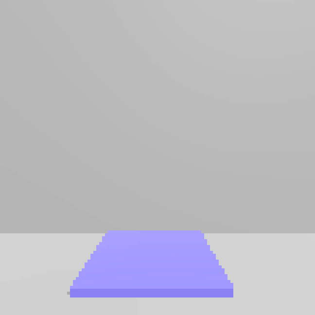
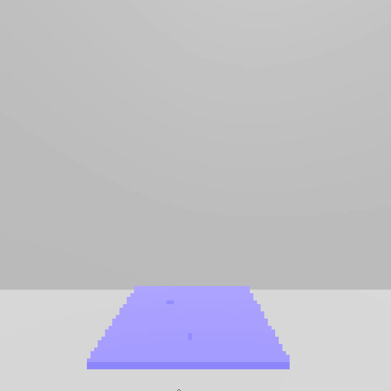
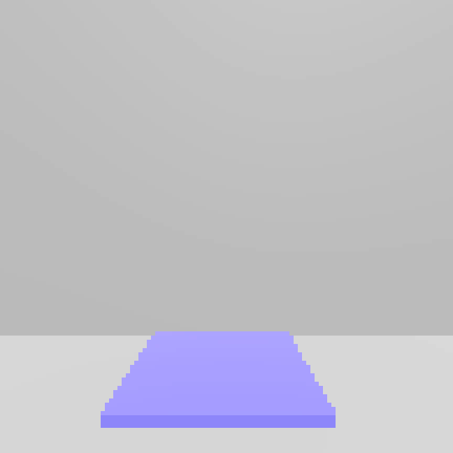

## What's new?

### Tile to objects interactions
New tile objects can now interact with other objects that collide with their detector's hitbox.
Below are different interaction scenarios between a tile that destroyes objects its getting pressed by and some dummy item cubes.

#### *The tile was first set on a hold delay using a timer*

#### *The tile was first forced into pressed state by a script*
